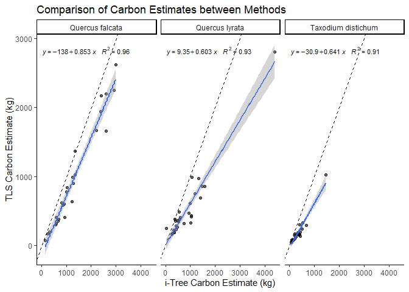
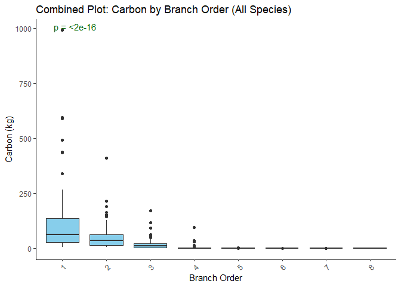

**Turn off the warning in markdown**

``` r
knitr::opts_chunk$set(warning = FALSE, message = FALSE)
```

**Automatically install and load required libraries**

**Read the data**

``` r
data <- read.csv("TLSvsiTree/tlsitree.csv")
```

**Ensuring proper data structure and calculating the difference in
estimates between two methods**

``` r
clean_data <- data %>%
  drop_na() %>%
  mutate(
    difference = carbon_tls - carbon_itree,
    percent_diff = (difference/carbon_itree) * 100
  )
```

**Descriptive Statistics**

``` r
##Summary statistics of individual species
summary_stats <- clean_data %>%
  group_by(species) %>%
  summarise(
    mean_tls = mean(carbon_tls),
    sd_tls = sd(carbon_tls),
    mean_itree = mean(carbon_itree),
    sd_itree = sd(carbon_itree),
    mean_diff = mean(difference),
    rmse = sqrt(mean(difference^2)),
    ccc = CCC(carbon_tls, carbon_itree)$rho.c,
    pearson_r = cor(carbon_tls, carbon_itree, method = "pearson"),
    pearson_p_value = cor.test(carbon_tls, carbon_itree, method = "pearson")$p.value
  )
##Summary statistics of all species combined
summary_stats_combined <- clean_data %>%
  summarise(
    mean_tls = mean(carbon_tls),
    sd_tls = sd(carbon_tls),
    mean_itree = mean(carbon_itree),
    sd_itree = sd(carbon_itree),
    mean_diff = mean(difference),
    rmse = sqrt(mean(difference^2)),
    ccc = CCC(carbon_tls, carbon_itree)$rho.c,
    pearson_r = cor(carbon_tls, carbon_itree, method = "pearson"),
    pearson_p_value = cor.test(carbon_tls, carbon_itree, method = "pearson")$p.value
  )
```

### Summary Statistics of carbon estimates

``` r
summary_stats_combined$species="combined"
descriptive_stats=rbind(summary_stats,summary_stats_combined)
kable(descriptive_stats,digits = 2)
```

| species | mean_tls | sd_tls | mean_itree | sd_itree | mean_diff | rmse | ccc | pearson_r | pearson_p_value |
|:---|---:|---:|---:|---:|---:|---:|:---|---:|---:|
| Quercus falcata | 977.15 | 753.96 | 1307.47 | 863.72 | -330.32 | 386.09 | 0.8914300 | 0.98 | 0 |
| Quercus lyrata | 521.46 | 500.68 | 848.94 | 799.77 | -327.48 | 470.92 | 0.7706347 | 0.96 | 0 |
| Taxodium distichum | 181.78 | 188.20 | 331.60 | 279.75 | -149.82 | 187.67 | 0.7326829 | 0.95 | 0 |
| combined | 558.70 | 616.47 | 830.06 | 797.75 | -271.36 | 372.22 | 0.8714184 | 0.97 | 0 |

**Test for Normality using shapiro wilk normality test**

``` r
model=lm(carbon_tls~carbon_itree,data=clean_data)
shapiro.test(resid(model))
```

    ## 
    ##  Shapiro-Wilk normality test
    ## 
    ## data:  resid(model)
    ## W = 0.94206, p-value = 0.001146

we got p\<0.05. Hence the data is not normally distributed. So we used
Wilcoxon paired t test to compare the difference in mean between itree
and tls based carbon

``` r
wilcox_test=wilcox.test(clean_data$carbon_itree,clean_data$carbon_tls, paired = TRUE)
wilcox_test
```

    ## 
    ##  Wilcoxon signed rank test with continuity correction
    ## 
    ## data:  clean_data$carbon_itree and clean_data$carbon_tls
    ## V = 3276, p-value = 2.874e-14
    ## alternative hypothesis: true location shift is not equal to 0

**Subsetting only values to compare two methods for all species
combined**

``` r
combined_data=clean_data[,2:3]
colnames(combined_data)=c("tls","itree")
```

### Box plot for all species combined using wilcox paired t test

``` r
ggplot(pivot_longer(combined_data, cols = everything(), 
                    names_to = "method", values_to = "carbon_kg"), ##converting into long format
       aes(x = method, y = carbon_kg, fill = method)) +
  geom_boxplot(fill=c("pink","skyblue")) +
  stat_compare_means(label = "p.format",col="darkgreen",paired=T)+
  theme_classic() +
  labs(title = "Comparision between two methods of carbon estimates",
       x = "Method", y = "Carbon Estimate (kg)") +
  theme(axis.text.x = element_text(angle = 0, hjust = 0.5))
```

<!-- -->

### Box plots by species (Individual plots per species) using wilcox t test

``` r
ggplot(clean_data %>%
  group_by(TreeID, species) %>%
  pivot_longer(cols = c(carbon_tls, carbon_itree), 
               names_to = "type", values_to = "carbon"), aes(x = type, y = carbon, fill = type)) +
  geom_boxplot(fill=c("pink","skyblue","pink","skyblue","pink","skyblue")) +
  stat_compare_means(paired=T, label = "p.format",col="darkgreen")+
  facet_wrap(~ species, scales = "free_y") +
  scale_x_discrete(labels = c("carbon_itree" = "itree", "carbon_tls" = "tls"))+
  labs(title = "Species wise comparision",
       x = "Method",
       y = "Carbon (kg)") +
  theme_classic()+theme(axis.text.x = element_text(angle = 0, hjust = 0.5),strip.background=element_blank())
```

<!-- -->

### Combined species Scatter plot with regression line

``` r
scatter_plot_combined <- ggplot(clean_data, aes(x = carbon_itree, y = carbon_tls)) +
  geom_point(aes(color = species), alpha = 0.6) +
  geom_abline(slope = 1, intercept = 0, linetype = "dashed") +
  geom_smooth(method = "lm", se = TRUE) +
  stat_poly_eq(aes(label = paste(..eq.label.., ..rr.label.., sep = "~~~")), 
                                                      formula = y ~ x, 
                                                      parse = TRUE, 
                                                      size = 4)+
  theme_classic() +
  labs(x = "i-Tree Carbon Estimate (kg)",
       y = "TLS Carbon Estimate (kg)",
       title = "Comparison of Carbon Estimates between Methods")
scatter_plot_combined
```

<!-- -->

### Scatter plot with regression lines for each species

``` r
scatter_plot_combined <- ggplot(clean_data, aes(x = carbon_itree, y = carbon_tls)) +
  geom_point( alpha = 0.6) +
  geom_abline(slope = 1, intercept = 0, linetype = "dashed") +
  geom_smooth(method = "lm", se = TRUE) +
  stat_poly_eq(aes(label = paste(..eq.label.., ..rr.label.., sep = "~~~")), 
                                                      formula = y ~ x, 
                                                      parse = TRUE, 
                                                      size = 3)+
  facet_wrap(~species)+
  theme(legend.position = "none") +
  theme_classic() +
  labs(x = "i-Tree Carbon Estimate (kg)",
       y = "TLS Carbon Estimate (kg)",
       title = "Comparison of Carbon Estimates between Methods"
       )
scatter_plot_combined
```

<!-- -->

### Create scatter plot with regression lines by species and stacked R² values

``` r
# Calculate regression statistics for each species
species_stats <- clean_data %>%
  group_by(species) %>%
  summarise(
    r2 = summary(lm(carbon_tls ~ carbon_itree))$r.squared,
    intercept = coef(lm(carbon_tls ~ carbon_itree))[1],
    slope = coef(lm(carbon_tls ~ carbon_itree))[2]
  )

# Create positions for stacked R² values
species_stats <- species_stats %>%
  mutate(
    y_position = seq(
      from = max(clean_data$carbon_tls),
      by = -max(clean_data$carbon_tls)/20,  # Adjust this divisor to change spacing
      length.out = n()
    )
  )

# Create the plot
scatter_plot <- ggplot(clean_data, aes(x = carbon_itree, y = carbon_tls, color = species)) +
  # Add points
  geom_point(alpha = 0.6) +
  # Add 1:1 reference line
  geom_abline(slope = 1, intercept = 0, linetype = "dashed", color = "gray50") +
  # Add regression lines by species
  geom_smooth(method = "lm", se = TRUE, aes(fill = species)) +
  # Add R² values in stacked format
  geom_text(
    data = species_stats,
    aes(
      x = min(clean_data$carbon_itree),
      y = y_position,
      label = sprintf("%s: R² = %.3f", species, r2),
      color = species
    ),
    hjust = 0,
    vjust = 0,
    size = 3,
    fontface = "bold"
  ) +
  # Customize theme and labels
  theme_classic() +
  theme(
    legend.position = "right",
    panel.grid.minor = element_blank(),
    legend.title = element_text(face = "bold"),
    axis.title = element_text(face = "bold")
  ) +
  labs(
    x = "i-Tree Carbon Estimate (kg)",
    y = "TLS Carbon Estimate (kg)",
    title = "Comparison of Carbon Estimates between Methods",
    subtitle = "Regression lines shown by species",
    color = "Tree Species",
    fill = "Tree Species"
  )
```

### Regression statistics

``` r
kable(data.frame(species_stats))
```

| species            |        r2 |   intercept |     slope | y_position |
|:-------------------|----------:|------------:|----------:|-----------:|
| Quercus falcata    | 0.9551987 | -138.305372 | 0.8531425 |   2802.333 |
| Quercus lyrata     | 0.9285047 |    9.347948 | 0.6032404 |   2662.216 |
| Taxodium distichum | 0.9090372 |  -30.908026 | 0.6414079 |   2522.099 |

``` r
scatter_plot
```

<!-- -->

**Mainstem vs Branches and branchorder** **read the data**

``` r
data2=read.csv("branchorder/combined_tree_data.csv")
```

**Remove branch_order = 0 (main stem)**

``` r
branches_only <- data2 %>% filter(branch_order != 0)
```

**Create a summary for each tree with main stem and branch carbon**

``` r
carbon_summary <- data2 %>%
  group_by(TreeID) %>%
  summarize(
    main_stem_carbon = sum(carbon[branch_order == 0], na.rm = TRUE),
    branch_carbon = sum(carbon[branch_order != 0], na.rm = TRUE)
  )
```

### Combined Carbon by Branch Order (All species combined)

``` r
ggplot(branches_only, aes(x = factor(branch_order), y = carbon, fill = factor(branch_order))) +
  geom_boxplot(fill="skyblue") +
  theme_classic() +
  stat_compare_means(label = "p.format",col="darkgreen")+
  labs(title = "Combined Plot: Carbon by Branch Order (All Species)",
       x = "Branch Order",
       y = "Carbon (kg)") +
  theme(axis.text.x = element_text(angle = 45, hjust = 1))
```

<!-- -->

### Box plot of carbon by branch order for each species

``` r
ggplot(branches_only, aes(x = factor(branch_order), y = carbon, fill = factor(branch_order))) +
  geom_boxplot(fill="skyblue") +
  stat_compare_means(label = "p.format",col="darkgreen")+
  facet_wrap(~ Species, scales = "free_y") +
  labs(title = "Box Plot of Carbon by Branch Order per Species",
       x = "Branch Order",
       y = "Carbon") +
  theme_classic()+theme(strip.background = element_blank())
```

<!-- -->

### Summary for main stem and branch carbon

``` r
carbon_summary <- data2 %>%
  group_by(TreeID, Species) %>%
  summarize(
    main_stem_carbon = sum(carbon[branch_order == 0], na.rm = TRUE),# 0 order branch is mainstem
    branch_carbon = sum(carbon[branch_order != 0], na.rm = TRUE)
  ) %>%
  pivot_longer(cols = c(main_stem_carbon, branch_carbon), names_to = "type", values_to = "carbon")
```

### Main Stem vs Branch Carbon (Individual plots per species)

``` r
ggplot(carbon_summary, aes(x = type, y = carbon, fill = type)) +
  geom_boxplot(fill=c("pink","skyblue","pink","skyblue","pink","skyblue")) +
  stat_compare_means( label = "p.format",col="darkgreen")+
  facet_wrap(~ Species, scales = "free_y") +
  scale_x_discrete(labels = c("main_stem_carbon" = "Main Stem", "branch_carbon" = "Branch"))+
  labs(title = "Main Stem vs Branch Carbon (Individual Plots per Species)",
       x = "Type (Main Stem vs Branch)",
       y = "Carbon (kg)") +
  theme_classic()+theme(axis.text.x = element_text(angle = 0, hjust = 0.5),strip.background = element_blank())
```

<!-- -->

### Combined Main Stem vs Branch Carbon (All species combined)

``` r
ggplot(carbon_summary, aes(x = type, y = carbon, fill = type)) +
  geom_boxplot(fill=c("pink","skyblue")) +
  stat_compare_means( label = "p.format",col="darkgreen")+
  theme_classic() +
  scale_x_discrete(labels = c("main_stem_carbon" = "Main Stem", "branch_carbon" = "Branch"))+
  labs(title = "Combined Plot: Main Stem vs Branch Carbon (All Species)",
       x = "Type",
       y = "Carbon (kg)") +
  theme_classic()
```

<!-- -->

### Main Stem to Branch Carbon Ratio group by species

``` r
carbon_ratio <- carbon_summary %>%
  group_by(Species) %>%
  summarise(
    Main_Stem_Carbon = mean(carbon[type == "main_stem_carbon"], na.rm = TRUE),
    Branch_Carbon = mean(carbon[type == "branch_carbon"], na.rm = TRUE),
    Ratio = Main_Stem_Carbon / Branch_Carbon  # Compute the ratio
    )
```

``` r
kable(carbon_ratio,digits = 3)
```

| Species            | Main_Stem_Carbon | Branch_Carbon | Ratio |
|:-------------------|-----------------:|--------------:|------:|
| Quercus falcata    |          698.436 |       278.717 | 2.506 |
| Quercus lyrata     |          259.350 |       262.110 | 0.989 |
| Taxodium distichum |          135.826 |        45.955 | 2.956 |
